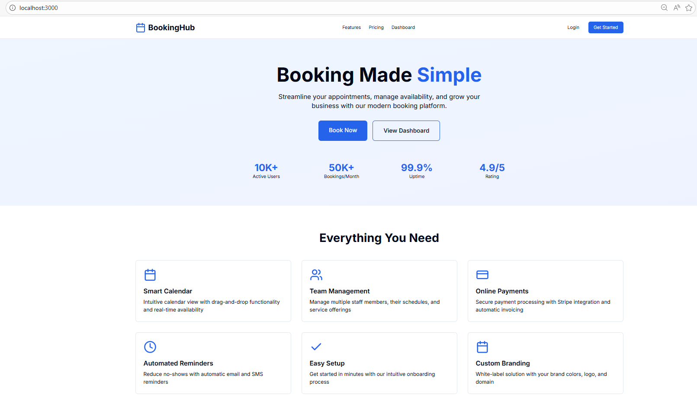
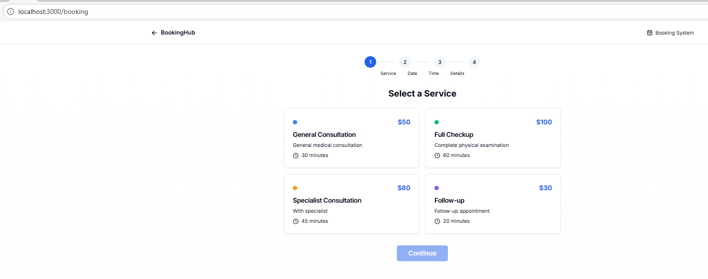
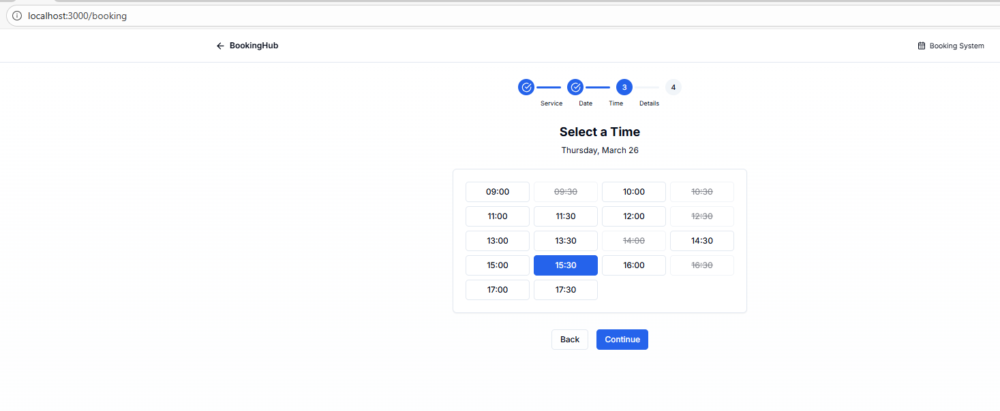
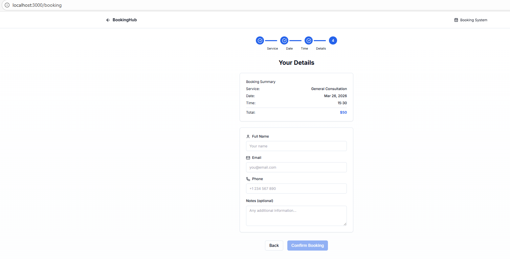
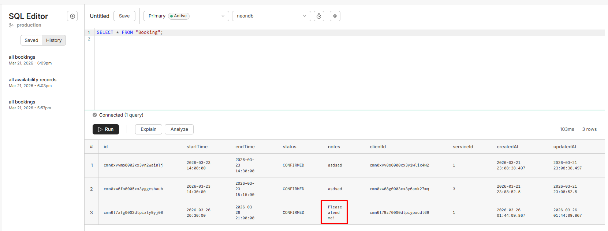

# 📅 BookingHub

<p align="center">
  
  
  
  
  
  
</p>

<p align="center">
  <strong>Open-source booking system built with modern web technologies</strong>
</p>

<p align="center">
  <a href="#-features">Features</a> •
  <a href="#-demo">Demo</a> •
  <a href="#-tech-stack">Tech Stack</a> •
  <a href="#-getting-started">Getting Started</a> •
  <a href="#-contributing">Contributing</a>
</p>

---

## ✨ Features

- 📆 **Smart Booking Flow** - 4-step booking process with real-time availability
- 🎨 **Modern UI** - Beautiful, responsive design with Tailwind CSS
- 🔐 **Authentication** - Secure auth with NextAuth.js
- 💳 **Payments Ready** - Stripe integration for payments
- 📊 **Dashboard** - Admin dashboard for managing bookings
- 🌙 **Dark Mode** - Built-in dark mode support
- 🗄️ **Database** - PostgreSQL with Prisma ORM
- 🚀 **Serverless** - Deploy anywhere (Vercel, Netlify, etc.)

## 🎬 Demo

### Landing Page


### Booking Flow
| Select Service | Select Time | Your Details |
|----------------|-------------|--------------|
|  |  |  |

### Database (Neon PostgreSQL)


**Live Demo:** [Coming Soon](#)

## 🛠️ Tech Stack

| Layer | Technology |
|-------|------------|
| **Frontend** | Next.js 14, React 18, TypeScript |
| **Styling** | Tailwind CSS, Shadcn/UI, Radix UI |
| **Backend** | Next.js API Routes |
| **Database** | PostgreSQL (Neon/Supabase) |
| **ORM** | Prisma |
| **Auth** | NextAuth.js |
| **Payments** | Stripe |
| **Forms** | React Hook Form + Zod |

## 🚀 Getting Started

### Prerequisites

- Node.js 18+ 
- npm or yarn
- PostgreSQL database (local or cloud like [Neon](https://neon.tech))

### Installation

1. **Clone the repository**
   ```bash
   git clone https://github.com/your-username/bookinghub.git
   cd bookinghub
   ```

2. **Install dependencies**
   ```bash
   npm install
   ```

3. **Set up environment variables**
   ```bash
   cp .env.example .env
   ```
   Edit `.env` with your database URL and other credentials.

4. **Set up the database**
   ```bash
   npx prisma db push
   npm run db:seed
   ```

5. **Start the development server**
   ```bash
   npm run dev
   ```

6. **Open your browser**
   Navigate to [http://localhost:3000](http://localhost:3000)

## 📁 Project Structure

```
bookinghub/
├── prisma/
│   ├── schema.prisma    # Database schema
│   └── seed.ts          # Seed data
├── src/
│   ├── app/
│   │   ├── api/         # API routes
│   │   ├── booking/     # Booking page
│   │   ├── dashboard/   # Dashboard page
│   │   └── page.tsx     # Home page
│   ├── components/
│   │   └── ui/          # Reusable UI components
│   ├── lib/
│   │   ├── db.ts        # Prisma client
│   │   └── utils.ts     # Utility functions
│   └── types/
│       └── index.ts     # TypeScript types
├── .env.example         # Environment variables template
├── package.json
└── README.md
```

## 🔧 Available Scripts

| Command | Description |
|---------|-------------|
| `npm run dev` | Start development server |
| `npm run build` | Build for production |
| `npm run start` | Start production server |
| `npm run lint` | Run ESLint |
| `npm run db:push` | Push schema to database |
| `npm run db:studio` | Open Prisma Studio |
| `npm run db:seed` | Seed the database |

## 🤝 Contributing

Contributions are welcome! Please feel free to submit a Pull Request.

1. Fork the repository
2. Create your feature branch (`git checkout -b feature/amazing-feature`)
3. Commit your changes (`git commit -m 'Add some amazing feature'`)
4. Push to the branch (`git push origin feature/amazing-feature`)
5. Open a Pull Request

## 📝 License

This project is licensed under the MIT License - see the [LICENSE](LICENSE) file for details.

## 🙏 Acknowledgments

- [Next.js](https://nextjs.org/)
- [Tailwind CSS](https://tailwindcss.com/)
- [Shadcn/UI](https://ui.shadcn.com/)
- [Prisma](https://www.prisma.io/)
- [Neon](https://neon.tech/)

---

<p align="center">
  Made with ❤️ by the community
</p>
